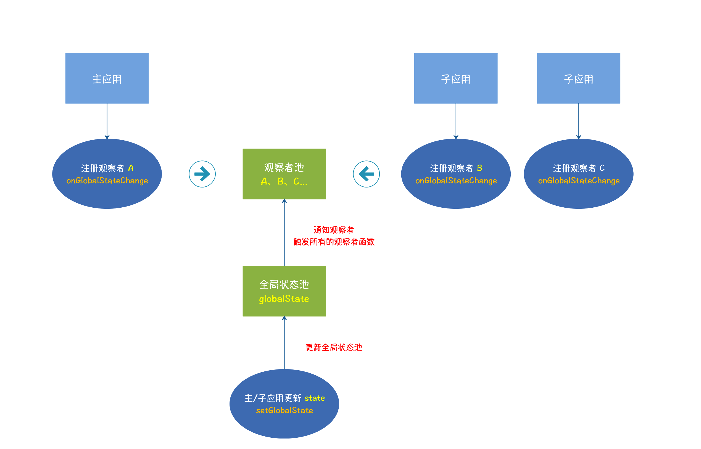
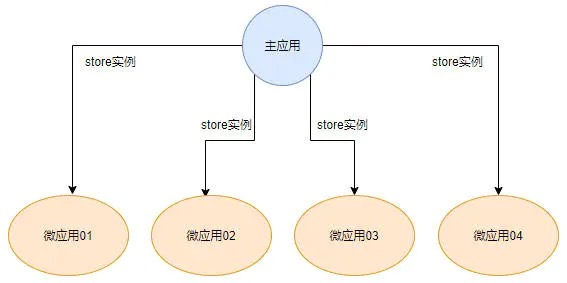

## 微前端框架-乾坤的实际落地使用方式

## 微前端是什么？

- 一个针对前端大型，超大型项目遇到项目运维，开发瓶颈的解决方案

## 微前端针对谁？

- 大型或者超大型前端项目

## 怎么理解微前端？

1. 与你当前技术无关，比如:vue,react,angular,jquery 等等，混着用都行，都没关系
2. 将一个大型项目，以模块化思维进行拆分，独立开发，独立部署，独立运行，最终由主框架同步更新
3. 增量升级，对于大型项目，快速迭代，项目体积臃肿，无论是打包，还是发布，都不灵活，微前端，自应用可以独立部署，灵活度大大提升
4. 独立运行，状态隔离，状态不共享等

## 设计思路

1. 整个项目既然庞大，那就把各个模块拆开，化整为零，模块独立自治包括开发？部署？等运维操作等
2. 最终把多个模块拼装起来，放到一个公共的容器中，只要让各个模块功能打通即可
3. 所以架构基调，一主，多从。

## 乾坤框架

> 来自阿里体系的微前端解决方案：https://qiankun.umijs.org/zh

## 为什么选择乾坤？

1. 基于 single-spa 封装而来，但解决了 single 的弊端，如全局样式混乱，全局变量污染，
2. 易用，成熟，可靠案例多，大厂嫡系解决方案，稳定性 ok
3. 包含了样式隔离，js 沙箱，预加载等一些列生产解决方案

# 怎么用？

1. 一个主项目，多个子项目
2. 所以先搭建一个基座
3. 再创建子应用
4. 将子应用跟主应用关联起来
5. 将各个子应用关联起来

# 所以在学什么？

1. 配置，主项目和从项目的具体配置
2. 原理，为什么这么配？背后到底干了什么
3. 实际应用

## 先配置主应用（基座）

### 具体步骤

> 一、主项目安装乾坤
> `npm i qiankun -S`
> 二、src 目录下新增一个 registApp.js 专门用来注册子应用

```js
// 注册app
import { registerMicroApps, start } from "qiankun";
// 加载状态
const loader = (loadding) => {
  console.log(loadding);
};
const apps = [
  {
    name: "one",
    entry: "http://192.168.8.117:8081/", // 根据地址加载子应用，解析js，所以子应用必须支持跨域，让我主应用可以加载的到
    container: "#container", // 将子应用挂载到哪个元素？
    activeRule: "/one", // 激活子应用的路由
    loader, // 加载状态
  },
  {
    name: "two",
    entry: "http://192.168.8.117:8082/",
    container: "#container",
    activeRule: "/two",
    loader,
  },
  {
    name: "vue3",
    entry: "http://192.168.8.117:8083/",
    container: "#container",
    activeRule: "/vue3",
    loader,
  },
];

// 注册子应用，并且暴露对应的生命周期钩子，你可以根据需求写逻辑
registerMicroApps(apps, {
  //加载前
  beforeLoad: (params) => {
    console.log("加载前", params);
  },
  //挂载前
  beforeMount: (params) => {
    console.log("挂载前", params);
  },
  // 挂载后
  afterMount: (params) => {
    console.log("挂载后", params);
  },
  // 卸载前
  beforeUnmount: (params) => {
    console.log("卸载前", params);
  },
  // 卸载后
  afterUnmount: (params) => {
    console.log("卸载后", params);
  },
});

// 开启
start({
  sandbox: {
    // experimentalStyleIsolation: true, // 添加挂载容器，你可以理解为scoped
    strictStyleIsolation: true, // showDom思路，完全隔离dom，无法互相访问
  },
});
```

> 三、改造 app.vue

```html
<div id="app">
  <el-menu :router="true" mode="horizontal">
    <!-- 基座-放置主框架自己的东西 -->
    <el-menu-item index="/">主页</el-menu-item>
    <el-menu-item index="/one">子应用</el-menu-item>
    <el-menu-item index="/two">子应用</el-menu-item>
  </el-menu>
  <router-view />
  <div id="container"></div>
</div>
```

> 四、main.js 中引入 registApp.js
> 五、运行所有子项目
> 六、切换主项目的路由------>跨域了吧？？？

## 配置子应用

1、首先要做的就是打包子应用生命周期，并且暴露出去
2、改写子项目的配置文件，使子项目的资源始终用的是自己服务器上的 资源而不是用的主框架的资源（需要理解微前端的实现原理）

> 新建 vue.config.js

```js
module.exports = {
  publicPath: "//localhost:8081", // 静态资源指回原有自己的服务器，而不是被主框架读过去后用了主框架的静态资源
  devServer: {
    port: "8081",
    headers: {
      "Access-Control-Allow-Origin": "*", // 允许主框架读取资源
    },
  },
  configureWebpack: {
    // 打包文件出口
    output: {
      libraryTarget: "umd", //打包成umd格式（相比于cmd,amd规范，umd能兼容他俩，所以做通用模块,而且主框架通过featch（promise）方式获取子应用可以直接解析umd模块）
      library: "part-one", // 资源命名
    },
  },
};
```

> 暴露乾坤要的 API->改写 main.js

```js
import Vue from "vue";
import App from "./App.vue";
import routes from "./router";
import store from "./store";
import VueRouter from "vue-router";
import actions from "./actions";

Vue.config.productionTip = false;

// 确保主项目切到子项目路由时再去挂载项目
let router = null;
let app = null;
const isQiankun = window.__POWERED_BY_QIANKUN__;
function render(props = {}) {
  if (props) {
    actions.setActions(props);
  }
  const { container } = props;
  router = new VueRouter({
    base: isQiankun ? "/one/" : "/", // 如果是在主项目中被加载应用时，则改成跟主应用一样的base路由，否则，就按照本地的规则
    mode: isQiankun ? "history" : "hash",
    routes,
  });
  app = new Vue({
    store,
    router,
    render: (h) => h(App),
  }).$mount(container ? container.querySelector("#app") : "#app"); //存在乾坤容器吗？有就用，没有就用自己的
}

//独立运行，__POWERED_BY_QIANKUN__这个属性是乾坤暴露在windows上，判断当前的应用运行环境，如果不在乾坤中则独立运行，否则那就在乾坤之行钩子函数时执行渲染
if (!isQiankun) {
  render();
}
// 必须暴露这些钩子函数
export async function bootstrap() {
  console.log("one app bootstraped");
}
export async function mount(props) {
  //在自应用挂载时，会将乾坤的容器等参数塞进来
  render(props);
}
// 子应用卸载时，将不用的对象全部销毁
export async function unmount() {
  console.log("one app unmount");
  app.$destroy();
  app.$el.innerHTML = "";
  router = null;
  app = null;
}
```

## 样式隔离

> 子应用之间样式隔离

- 默认采用的动态样式表，加载时添加样式，卸载时删除样式
  > 主从之间的隔离怎么处理？
- 人力干预：BEM(不推荐)
- css-moudles：动态生成前缀(不推荐-也不能完全隔离)
- 乾坤提供了一个试验性样式隔离
  > 主应用 registApp.js,给乾坤的 start 函数注入一个对象
- 还有一个 shadowDom 的隔离方式

```js
// 开启
start({
  sandbox: {
    // experimentalStyleIsolation: true, // 添加挂载容器，你可以理解为scoped，密闭性一般，但思路简单
    strictStyleIsolation: true, // shadowDom思路，完全隔离dom，无法互相访问
  },
```

## js 隔离

- 支持 proxy 时
  - 单例：legacySandBox，
  - 多例：proxySandBox
- 不支持 proxy 时
  - 降级->napshotSandBox。

## 预加载方案

> 主动预先加载指定子项目的静态资源，对于静态资源体积过大的自应用可以直接采用改方案
> 主应用/registApp.js

2. `start({prefetch:true|all|[]|()=>{}})` 默认开启：prefetch：true

## 默认启用子应用

> 主应用/registApp.js 中从乾坤解析出 setDefaultMountApp 方法

1. `import {setDefaultMountApp } from "qiankun";`
2. `setDefaultMountApp("/vue3");`

## 应用通信（Actions-官方推荐）-Micro-part-one

> Actions 通信（官方示例）

- 核心知识点：观察者模式
- 优点：

  - 使用简单；
  - 官方支持性高；
  - 适合通信较少的业务场景；

- 缺点：

  - 子应用独立运行时，需要额外配置无 Actions 时的逻辑；
  - 子应用需要先了解状态池的细节，再进行通信；
  - 由于状态池无法跟踪，通信场景较多时，容易出现状态混乱、维护困难等问题；

- 先看图示意
  

> 主应用配置

- 跟目录或指定目录新增一个 actions.js

```js
import { initGlobalState, MicroAppStateActions } from "qiankun";

// 注意：MicroAppStateActions 是个类型，在ts中要做类型判断
// 应用通信
const initState = {
  // 声明你需要共享/需要双向通信的数据
  main: "",
};
const actions = initGlobalState(initState);
export default actions;
```

> 在组件内引用 actions.js 并使用

- `import actions from "./actions";`

```js
  methods: {
    setval() {
      let main = this.main;
      // 将数据传给子应用
      actions.setGlobalState({ main });
    },
  },
  mounted() {
    // 组件挂在是监听state（包括自己/子应用传过来的，双向通信）
    actions.onGlobalStateChange((state, preState) => {
      console.log("当前值", state);
      console.log("上一个值", preState);
      this.main = state.main;
    });
  },
```

> 主组件输入时将数据同步给子应用

- `<el-input @input="setval" v-model="main"></el-input>`

> 子应用配置

- 跟目录或者其他目录新建 actions.js

```js
function emptyAction() {
  console.warn("Current execute action is empty!");
}

class Actions {
  actions = {
    onGlobalStateChange: emptyAction,
    setGlobalState: emptyAction,
  };
  setActions(actions) {
    this.actions = actions;
  }

  onGlobalStateChange(...args) {
    // 映射方法
    return this.actions.onGlobalStateChange(...args);
  }

  setGlobalState(...args) {
    //// 映射方法
    return this.actions.setGlobalState(...args);
  }
}

const actions = new Actions();
export default actions;
```

> 将映射方法通过 render 注入到乾坤框架

- main.js

```js
import actions from "./actions";
// render函数中
function render(props = {}) {
  if (props) {
    actions.setActions(props);
  }
}
```

> 子应用组件中

- 输入框：`<input v-model="main" @input="setState()" />`

```js
import actions from "../actions";
methods:{
  setState() {
   const main = this.main;
   actions.setGlobalState({ main }); // 子应用同步给父级应用
 },
},
mounted() {
   // 监听数据
    actions.onGlobalStateChange((state) => {
      const { main } = state;
      this.main = main;
    });
 },
```

## 应用通信（Shared-基于 vuex/redux 等第三方）-Micro-part-two

- 优点：
  - 子应用无法随意污染主应用的状态池，只能通过主应用暴露的 shared 实例的特定方法操作状态池，从而避免状态池污染产生的问题。
  - 子应用将具备独立运行的能力
- 看图示意
  

- 本质上就是共享一个 store 你懂我意思吧？？就是把主项目 store 让各个子项目共享

> 改造主项目

- registApp.js
  - 引入 store `import store from "./store";`
- 将主项目 store 以参数形式传给指定子项目

```js
  {
    name: "two",
    entry: "http://192.168.8.117:8082/",
    container: "#container",
    activeRule: "/two",
    loader,
    props: {
      mainStore: store, // 将主项目的store注入到子项目中
    },
  },
```

- 给 store 添加一个测试数据

```js
import Vue from "vue";
import Vuex from "vuex";
Vue.use(Vuex);
export default new Vuex.Store({
  state: {
    token: "123456abc", // 共享数据
  },
  mutations: {
    setToken(state, val) {
      // 变更state
      state.token = val;
    },
  },
});
```

- 组件内，监听一下 state 数据

```js
  watch: {
    // vuex方案实时监听
    "$store.state.token": function(val, pre) {
      console.log("监听", val, "pre", pre);
      this.main = val;
    },
  },
```

- 修改组件事件内容

```js
  methods: {
    setval() {
      let main = this.main;
      // vuex方案
      this.$store.commit("setToken", main);
    },
  },
```

> 修改子项目

- main.js
  - render 函数中获取主项目的 store

```js
function render(props = {}) {
  // 传入主项目store
  const { container, mainStore } = props;
}
// 如果有props
if (props) {
  // 为主项目的store注册响应式
  Vue.observable(mainStore);
  // 将主项目store扩展到子项目
  Vue.prototype.$mainStore = mainStore;
}
```

- 双向同步数据

```html
<!-- 直接绑定主项目state通信完成 -->
<input v-model="$mainStore.state.token" />
```

## 还有其他通信方案吗？

- 有，比如 eventBus

## 公共组件库

- npm 私域即可
